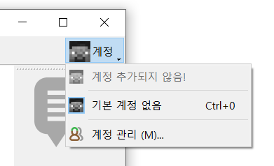
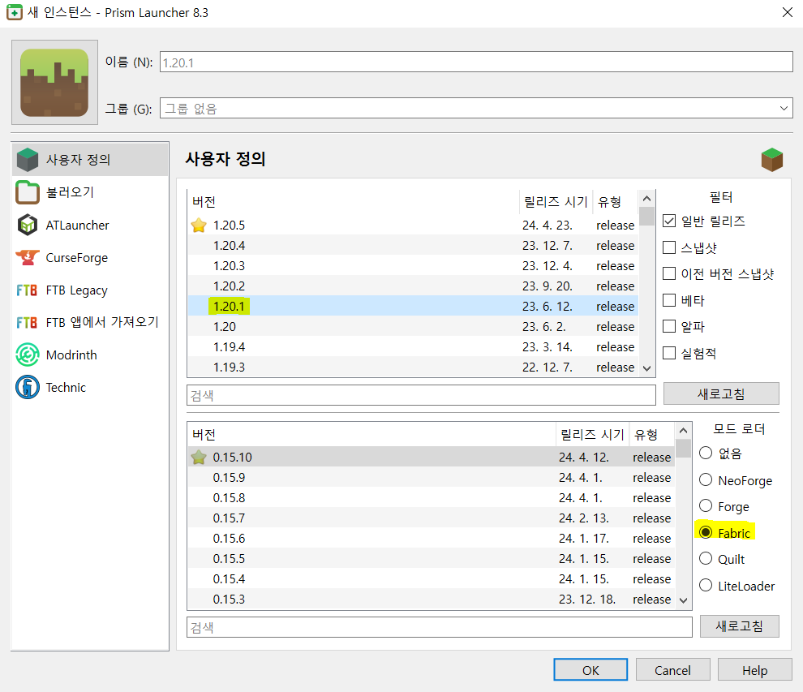
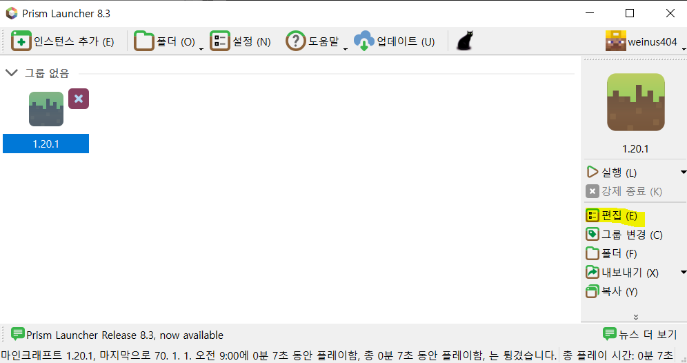
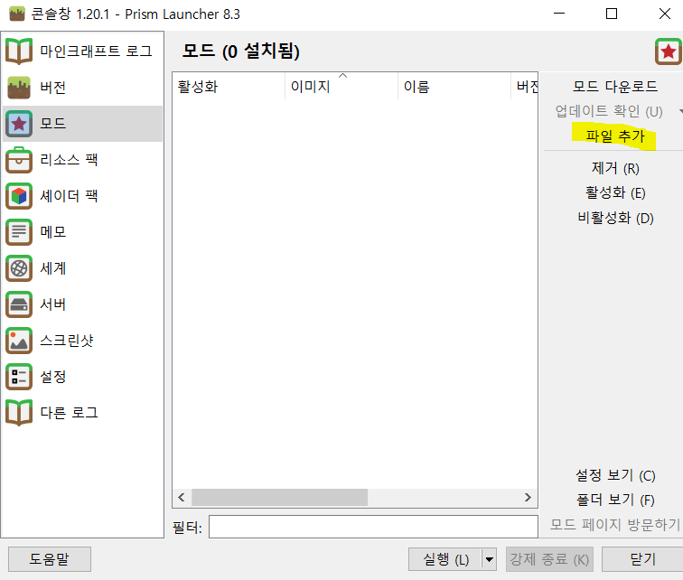

# 설치 가이드
장애크래프트에 참여하기 위한 설치 가이드입니다.

장애크래프트는 마인크래프트 `1.20.1`버전 및 `Fabric`을 사용합니다. 

버전에 맞는 **마인크래프트 자바에디션** 및 **자바 버전 18 이상**이 설치되었는지 확인해주세요.

# 1-1. (추천) Prism Launcher 사용

[Prism Launcher](https://prismlauncher.org/)은 무료 마인크래프트 런처로, 간편한 모드 설치와 버전 변경이 특징입니다.
> **왜 좋니?** : 모드로더 & 모드 설치 편함, 오픈소스임, 각각 버전마다 각각 다른 모드 적용 가능, 설정 불러오기&내보내기 편함, 디버깅 편함, 빠름, 계정 변경 가능, 걍 좋음 ㄹㅇ
> 
### 준비사항
* 마인크래프트 자바에디션을 구매한 (마이크로소프트) 계정
* Java 18 이상 ([Adoptium OpenJDK 설치](https://adoptium.net/))
* Visual C++ Redistributable 2022 x64 ([설치](https://aka.ms/vs/17/release/vc_redist.x64.exe))

### 설치
1. [모드팩](https://drive.google.com/drive/folders/1axEqjxyof262ACai33CYRI4uVMQCpQRf?usp=drive_link) 다운로드 & 폴더에 압축 풀기
2. [Prism Launcher 다운로드 & 설치](https://prismlauncher.org/download/?from=button)
3. 기본 설정 ( 언어 선택 > 자바 선택 > 테마 선택 )
4.  계정 관리 
5. Microsoft 계정 추가 > 로그인
6. 메인 화면에서 "인스턴스 추가"
7.  버전 `1.20.1`, 모드 로더 `Fabric` 선택 > OK
8.  "편집" 선택
9.  "모드" > "파일 추가" > 압축 푼 모드 **전체** 선택 > OK
10. 실행!

# 1-2. (병신용) 기본 마인크래프트 런처 사용
↑↑↑↑↑↑↑↑이거쓰면호구임↑↑↑↑↑↑↑↑↑

↑↑↑↑↑↑↑↑이거쓰면병신임↑↑↑↑↑↑↑↑↑

### 설치
1. [모드팩](https://drive.google.com/drive/folders/1axEqjxyof262ACai33CYRI4uVMQCpQRf?usp=drive_link) 다운로드 & 폴더에 압축 풀기
2. [런처 다운로드 & 설치](https://www.minecraft.net/en-us/download)
3. `1.20.1`버전 마인크래프트 설치
4. [Fabric Installer 다운로드 & 설치](https://fabricmc.net/use/installer/)
5. 마인크래프트 버전 : `1.20.1` 로더 버전 : `0.15.10`으로 설치
6. 마인크래프트(.minecraft) 모드(mods) 폴더에 다운로드한 모드 전체 넣기 ([방법](https://blog.naver.com/jjjj8768/222506772282))
7. 실행!

# 1-3. (거지용) TLauncher 사용

`TLauncher`은 3만원도 없는™ 거지들을 위한™ 무료™ 불법™ 마인크래프트 런처입니다.

바이러스가 없는걸로 알고있긴한데 있어도 그냥 달게 받으십시요

### 설치
1. [모드팩](https://drive.google.com/drive/folders/1axEqjxyof262ACai33CYRI4uVMQCpQRf?usp=drive_link) 다운로드 & 폴더에 압축 풀기
2. [TLauncher 설치](https://tlauncher.org/en/)
3. 계정이름 맘대로 짓기,  버전 `1.20.1`, `Fabric` 설치
4. 모드 설치
5. 실행

# 1-4. 기타 런처
구글에 `런처 이름+ fabric install`, `런처 이름+ mod install`검색해서 찾아보세요