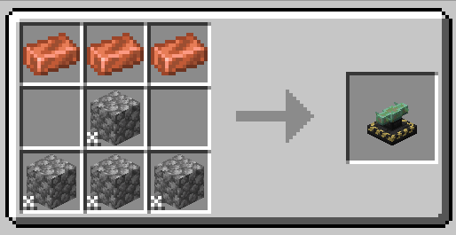

# Automobility

[Modrinth 페이지](https://modrinth.com/mod/automobility)

# 기능

* :red_car: 직접 만들 수 있는 자동차를 추가합니다.
* :motorway: 자동차 트랙을 추가합니다.

# 자동차 제작법

> `자동차 부품 제작대(Auto Mechanic Table)`에서 자동차 부품을 만들 수 있습니다.

> `자동차 조립대(Automobile Assembler)`에서 부품으로 자동차를 조립합니다.
> 부품을 자동차 조립대에 대고 우클릭하면 부품이 추가됩니다.

> `빠루(Crowbar)`로 부품을 제거합니다.

# 조작법

* `W` : 가속
* `S` : 감속, 후진
* `A/D` : 방향
* `Space` : 드리프트
* `우클릭` : 탑승
* `Shift` : 내리기

빠루(Crowbar)로 자동차를 우클릭하면 해체할수 있읍니다.