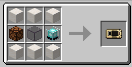

# Tempad

[Modrinth 페이지](https://modrinth.com/mod/tempad)

# 기능

* :calling: 휴대용 텔레포트 기계인 템패드를 추가합니다. 저장한 장소로 순간이동 할 수 있습니다.

# 사용법

템패드는 인벤토리나 Trinkets `장갑` 슬롯에 휴대할 수 있습니다.

템패드를 우클릭하거나 (기본)`B` 키를 눌러 상호작용하세요.

생성된 포탈을 타고 이동할 수 있습니다.